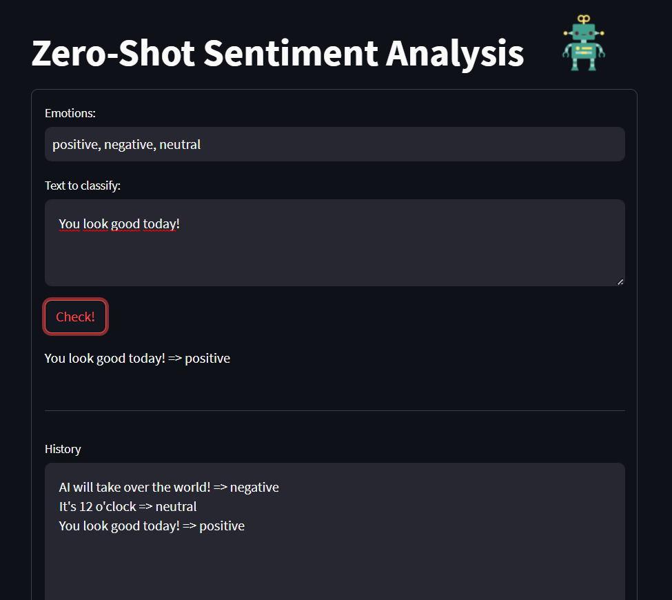
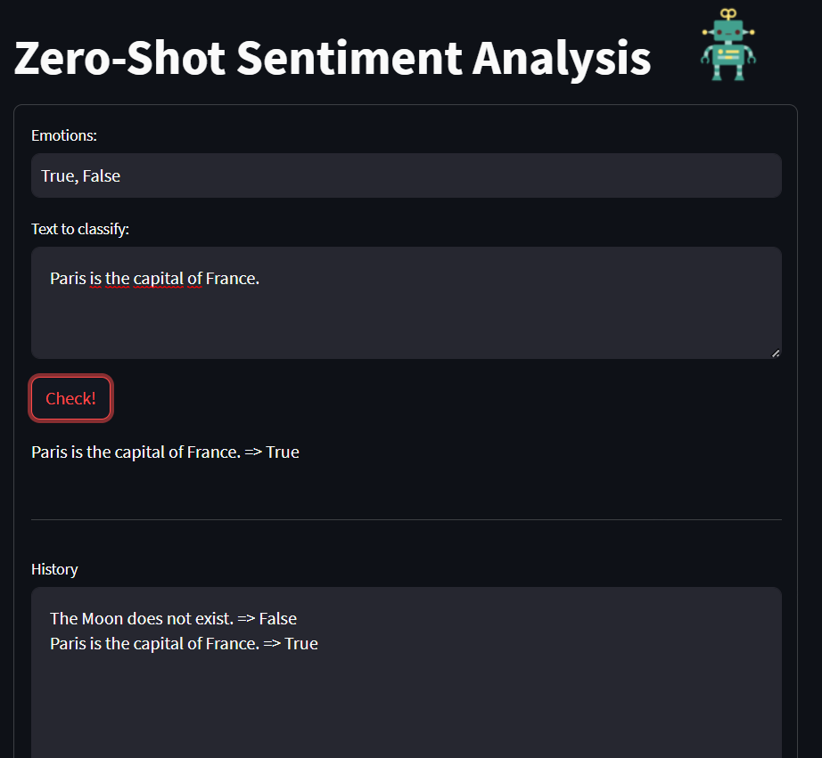

# Zero-Shot Sentiment Analysis with GPT-3.5-turbo

This repository contains an interactive Streamlit application that utilizes OpenAI's GPT-3.5-turbo model for zero-shot sentiment analysis. Users input a piece of text, and the application classifies the sentiment based on predefined emotions, displays the results, and maintains a history of past analyses.

## Features

- Zero-Shot Sentiment Analysis: Using GPT-3.5-turbo, this application provides an intuitive interface for performing zero-shot sentiment analysis.
- Sentiment History: Keeps track of all the sentiment analysis done during a session, providing a comprehensive review of the session's analysis.

## Requirements

- Python 3.6+
- OpenAI API key
- Streamlit
- python-dotenv
- openai

## Setup

1. Clone this repository to your local machine.
2. Install the required packages:
   ```
   pip install -r requirements.txt
   ```
3. Create a `.env` file in the root directory and add your OpenAI API key:
   ```
   OPENAI_API_KEY=your-api-key-here
   ```
4. Run the Streamlit app:
   ```
   streamlit run sentiment_analysis.py
   ```

## Usage

1. Launch the application and input the text you want to analyze in the provided text area.
2. Click 'Check!' and the application will classify the sentiment of the text based on predefined emotions.
3. The result is displayed below the 'Check!' button, and the history is maintained in the 'History' text area.

## Example sentiments



## Example True or false



## Contributing

Contributions to this project are welcome! Please feel free to open an issue or submit a pull request.

## License

This project is licensed under the terms of the MIT license. For more information, please see the [LICENSE](LICENSE) file.
